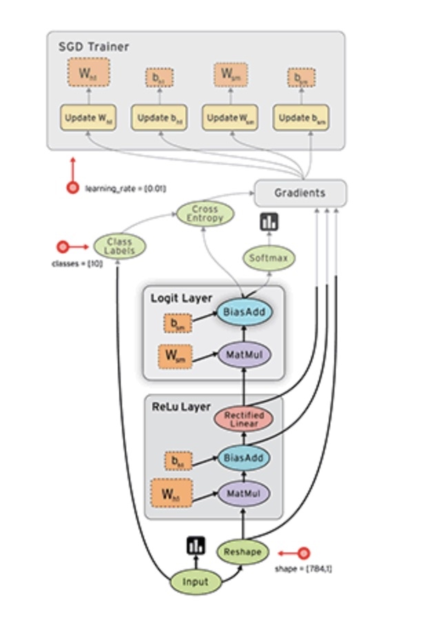
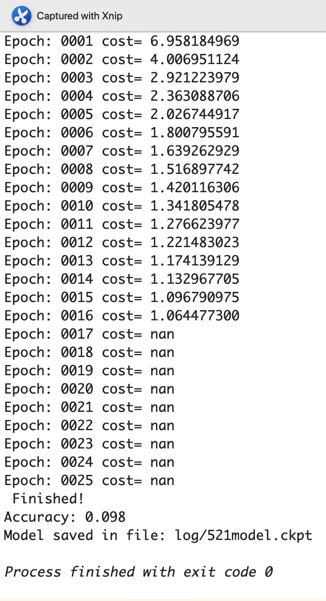
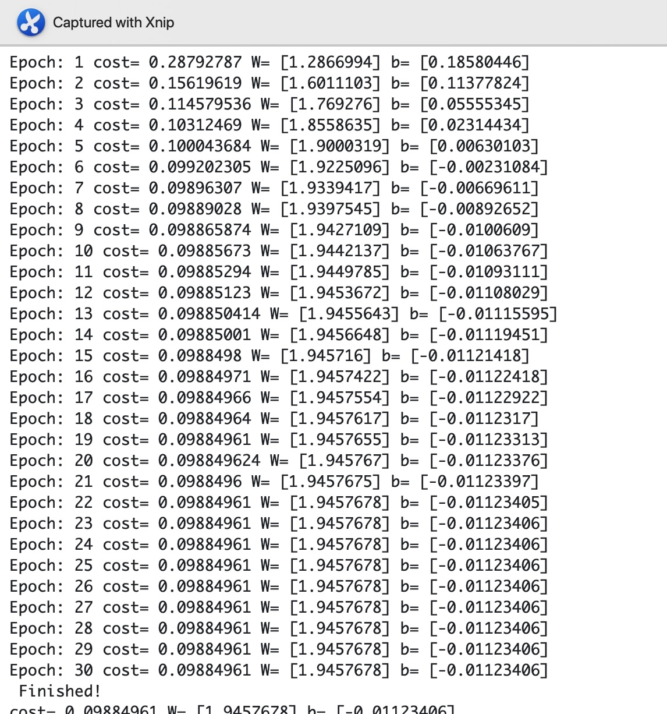
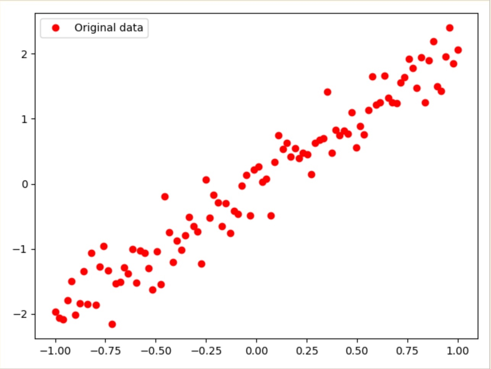
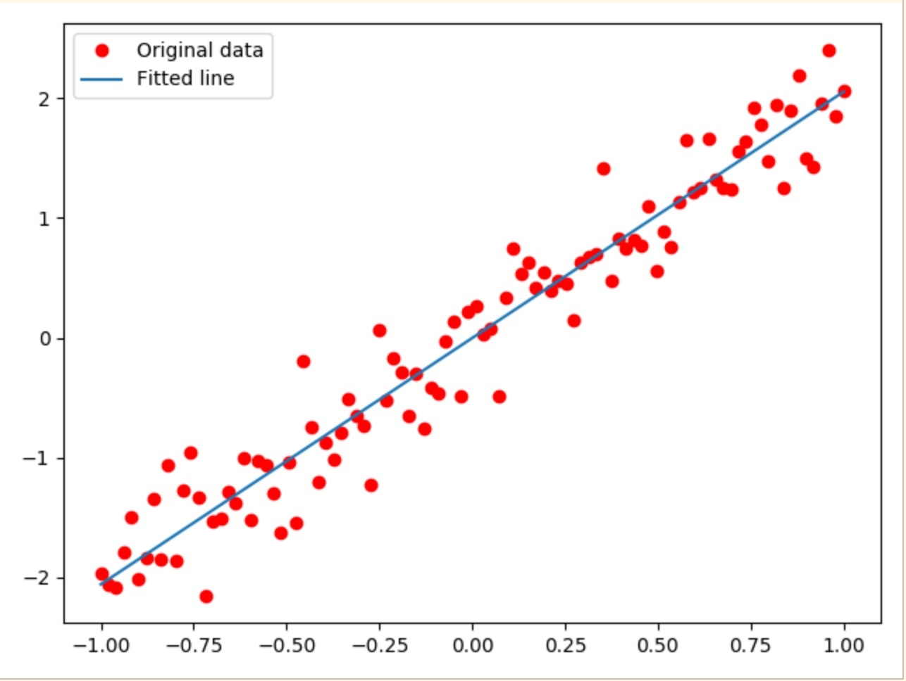

# TensorFlow 实践
## 理解 TensorFlow
&emsp;1. 花了好长时间才理解了 TensorFlow 的各个部分的意义，节点（Nodes）在图中表示数学操作，图中的线（edges）则表示在节点间相互联系的多维数据数组，即张量（tensor）。它灵活的架构让你可以在多种平台上展开计算，例如台式计算机中的一个或多个CPU（或GPU），服务器，移动设备等等。
&emsp;2. **张量从图中流过的直观图像是这个工具取名为“Tensorflow”的原因。一旦输入端的所有张量准备好，节点将被分配到各种计算设备完成异步并行地执行运算。**

&emsp;3. **TensorFlow主要是由计算图、张量以及模型会话三个部分组成。**
在TensorFlow中，首先需要构建一个计算图，然后按照计算图启动一个会话，在会话中完成变量赋值，计算，得到最终结果等操作。

因此，可以说TensorFlow是一个按照计算图设计的逻辑进行计算的编程系统。

&emsp;4. TensorFlow的计算图可以分为两个部分：
- 构造部分，包含计算流图；
    - 构造部分又分为两部分：
        - 创建源节点；
        - 源节点输出传递给其他节点做运算。
- 执行部分，通过session执行图中的计算。

TensorFlow默认图：TensorFlow python库中有一个默认图(default graph)。节点构造器(op构造器)可以增加节点。

&emsp;5.**张量**
在TensorFlow中，张量是对运算结果的引用，运算结果多以数组的形式存储，与numpy中数组不同的是张量还包含三个重要属性名字、维度、类型。

张量的名字，是张量的唯一标识符，通过名字可以发现张量是如何计算出来的。比如“add:0”代表的是计算节点"add"的第一个输出结果。维度和类型与数组类似。

&emsp;6.**模型会话**
用来执行构造好的计算图，同时会话拥有和管理程序运行时的所有资源。
当计算完成之后，需要通过关闭会话来帮助系统回收资源。
在TensorFlow中使用会话有两种方式。第一种需要明确调用会话生成函数和关闭会话函数

&emsp;7.**分布式原理**
tensorflow的实现分为了单机实现和分布式实现。
单机的模式下，计算图会按照程序间的依赖关系顺序执行。
在分布式实现中，需要实现的是对client，master，worker process，device管理。
- client也就是客户端，他通过session的接口与master和worker相连。
- master则负责管理所有woker的计算图执行。
- worker由一个或多个计算设备device组成，如cpu，gpu等。

## 实验过程
1. 通过运行 MLP：

此时的准确率是0.9817

2. 对 mnist 数据集进行分类：

我们可以看到，最后的准确率可以达到 0.98，并把对应的日志文件存到了 log/521model.ckpt

3. 在这个过程中我们对 Tensor 张量进行记录

对其张量最后结果进行记录

- 运行结果进行可视化可得
- 
- 
- 
- 通过可视化我们可以看见，最终通过 TensorFlow 很好的拟合了对应的点，并且随着次数的增加，loss 逐渐降低，最终趋向于 0.

## 调试错误
1. 出现please use urllib or similar directly错误，要求重新下载数据集

重新添加语句：
old_v = tf.logging.get_verbosity()
tf.logging.set_verbosity(tf.logging.ERROR)
from tensorflow.examples.tutorials.mnist import input_data
mnist = input_data.read_data_sets("MNIST_data/", one_hot=True)
tf.logging.set_verbosity(old_v)
实现更新数据集即可
